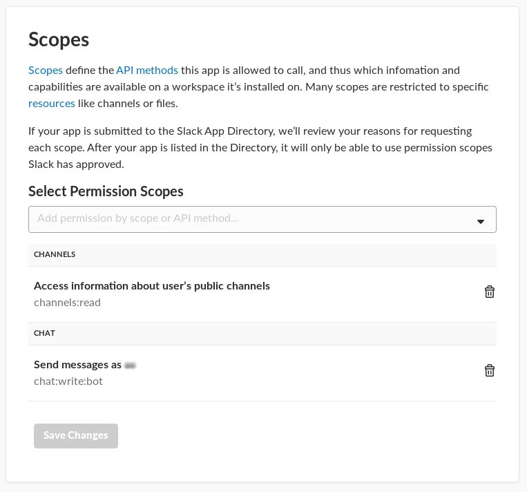
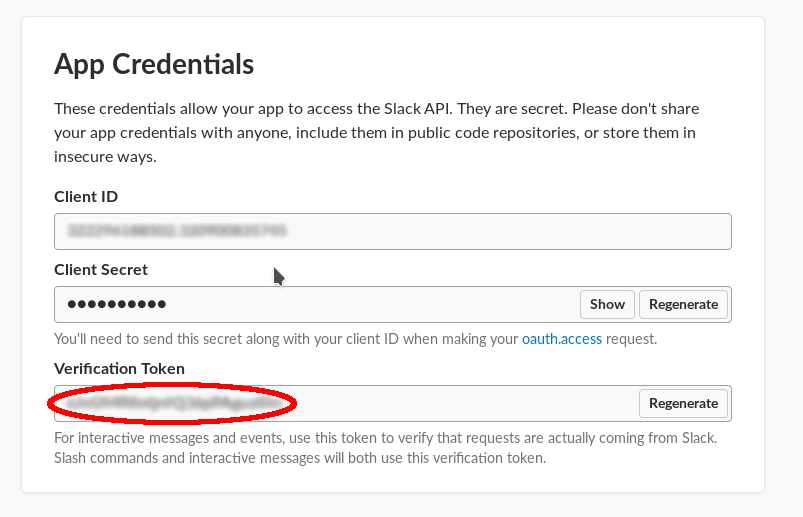
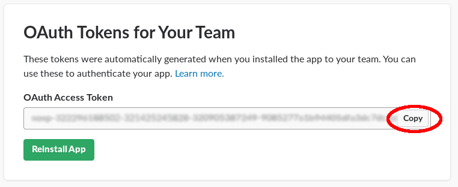
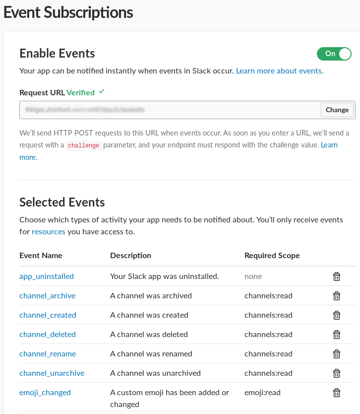

=================
Slack Application
=================

Quickstart for creating a slack application with Sir bot-a-lot.

Ngrok setup
-----------

For ease of coding we will develop our app locally but in order to do so we need a tool to be reachable by slack. For
this we will use `ngrok <https://ngrok.com/>`_.

* `Install <https://ngrok.com/download>`_ ngrok.
* Start an HTTP tunnel on port ``8080``.

.. code:: console

   $ ngrok http 8080

You should now have access to the ngrok web interface at `127.0.0.1:4040 <http://127.0.0.1:4040>`_ and see your http & https forwarding url (``http://xxxxxx.ngrok.io -> localhost:8080``).

Application setup
-----------------

* `Create a development slack team <https://slack.com/get-started#create>`_.
* `Create a new app <https://api.slack.com/apps>`_.
* Add the ``chat:write:bot`` & ``channels:read`` permissions to your application from the ``OAuth & Permissions`` page.

* Install the application to your workspace (Preferably on all public channels).
* Grab the ``Verification Token`` from the ``Basic Information`` page.

* Grab the ``OAuth Access Token`` from the ``Install App`` page.

Sir Bot-a-lot installation
--------------------------

`Sir Bot-a-lot is on PyPI <https://pypi.org/project/sirbot/>`_.

.. code:: console

   $ python3 -m venv .env      # Create a virtual environment
   $ source .env/bin/activate  # Activate the virtual environment
   $ pip3 install sirbot       # Install Sir bot-a-lot

Starting the Bot
----------------

* Copy the code in a ``bot.py`` file and fill the ``OAuth Access Token`` & ``Verification Token``.

.. code:: python3

   import logging
   logging.basicConfig(level=logging.DEBUG)

   from sirbot import SirBot
   from sirbot.plugins.slack import SlackPlugin

   OAUTH_ACCESS_TOKEN = ''
   VERIFICATION_TOKEN = ''

   bot = SirBot()

   slack = SlackPlugin(token=OAUTH_ACCESS_TOKEN, verify=VERIFICATION_TOKEN)
   bot.load(slack)

   bot.start(host='0.0.0.0', port=8080)

* Start your bot

.. code:: console

   $ (.env) python bot.py

Now that your bot is running we can start sending it events.

* Go back on your application configuration page (click `here <https://api.slack.com/apps>`_ to find it back).
* Add the ``Event Subscriptions`` feature. Set the url as your ngrok url (``http://xxxxxx.ngrok.io``).
* If everything is ok the url should be marked as ``Verified``.
* Add the ``message.channels`` event to the subscription.

* Type a message in your slack channel and you should see it coming in the logs.

.. code::

   sirbot.plugins.slack.endpoints - DEBUG - Incoming message: Slack Message: {'type': 'message', 'user': 'U29163YQH', 'text': 'test message', 'ts': '1519907093.000242', 'channel': 'C5MKJ21QR', 'event_ts': '1519907093.000242'}

Answering messages
------------------

Once we receive message the next step is to start answering them. For that we need to add some code to ``bot.py``.

.. code:: python3

   ...

   from slack import methods # Enum of the slack endpoints for better autocomplete

   ...

   # We create function that will be called on incoming message
   # The parameters are the incoming message and the aiohttp app
   async def hello(message, app):

      # We create a response object from the incoming message
      response = message.response()

      # We set the text of our message
      response['text'] = 'Hello <@{user}>'.format(user=message['user'])

      # We querry the slack api chat.postMessage with our response
      await app['plugins']['slack'].api.query(url=methods.CHAT_POST_MESSAGE, data=response)

   ...

   slack = SlackPlugin(token=OAUTH_ACCESS_TOKEN, verify=VERIFICATION_TOKEN)

   # We register our function to respond to message starting with ``hello``
   slack.on_message('^hello', hello)

   bot.load(slack)

   ...
